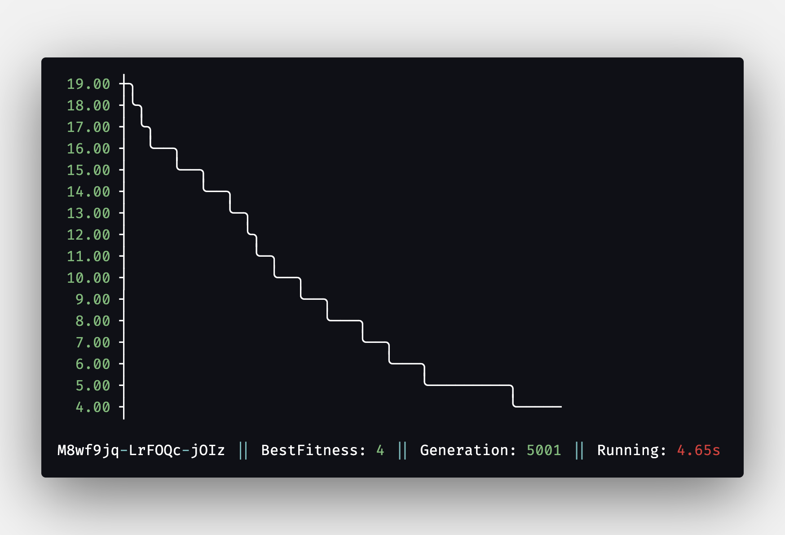
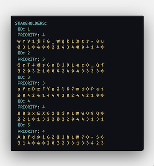
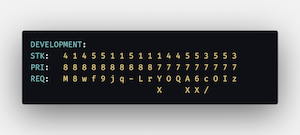
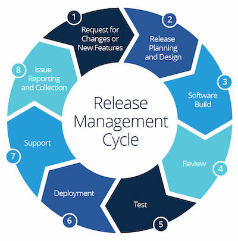

# Genetic algorithm

This repo is inspired by the article:
"A new approach to the software release planning", deColares et al.
https://citeseerx.ist.psu.edu/viewdoc/download?doi=10.1.1.189.1000&rep=rep1&type=pdf

### What does this code do?

It reproduces a simulation of a software project with genetic algorithms pattern.

### How does it work?

First, keep in mind that each development requirement is symbolized with one char generated with a random bytes number and then, converted to a string.

During the execution, you will observe a graph that symbolizes the development cicle progress. There is a duration for each release. At the release time, it prints one graph that shows the progress at the project, wich is a refference to the clients satisfaction.

There is a development team with 3 individuals. Each one, provides about 400 of solutions. They interact and work together to find the best solutions for each requirement. Then, they keep evolving and working together during runtime.

Each execution is a different project case scenario. It has 5 stakeholders and it's influence weight. All of them, have a list of requirements and it's priorities for each one. It prints the stakeholders with their requirements and their respective priorities. Then, it shows the merged requirements list for the project.

The first solutions are well known solutions by the development team, as well the prioritized ones, the last requirements are the toughest to proceed, due to challenges and software versioning stuff.

# Introduction

This project uses the concept of genetic algorithms, wich was implemented in Golang, using the library Eaopt.

It simulates the problem from the mentionated article, "the software release problem". This metaheuristic deliberates about common obstacles in software development industry during the execution of a project of software.

## Imagine the following situation

There is one new development project at your job. At the start, the product owner looks forward to understand the clients problem, however, each stakeholder have it's own requirement ideas and priorities. One important detail is that each stakeholder have it's influence capabilities.

The limit of resources is a fact. Our development teams are made of a few developers. It has a limit of workload. In front of that, when the product owner collects all requirements from the stakeholders, it's time to make the project planning.

Given these informations, the requirements list of each stakeholder has to be merged and prioritized in a single project backlog. Another important fact is the precedence of tasks to execute another ones. After this, the project development is all ready to begin!

Wait! The clients have a few questions. When is the first release? What will be implemented? How long does it will take to develop a satisfactory product? These kinds of questions are frequently asked by the clients, and these questions are the most hard to answer, due to an uncertainty scenario. Fortunatelly, our project owner is a very competent professional and knows how to deal with the client. Now, the development begins!

Our development team doesn't know what kind of requirements they will face at this project. Despite of the qualifications of our product owner (of course nobody doubts of that), their vision of the product is not the same as the client's. That's because not even the clients dont know what they want! They know that there is a problem that can be solved with a software, but most of them doesn't know how and even how a software works.

Facing the uncertain challenges with the development tasks. Some developers have an idea how to implement a solution for a given requirement. Although, the most frequently thinking of a software developer is:

> _"Oh crap... How do I solve this?"_

Humans are a complex life being, as the society and social relations. We don't have answers for most of the questions, probably, we have more questions for another question. That's the essence of a problem: one situation that needs to be solved. Some of them we know how, but we can't, due to the lack of resources. However, for the most of them we have to face a challenge, learn something, keep evolving.

#### This project is about that, it simulates the progress of a software development in an uncertain scenario, with individual developers, which interacts with each other to learn and solve a problem together

# Execution

The repository contains one binary executable for your OS: Windows or Unix systems (MacOS or Linux).

Another option is to execute by the source with Go (Golang) programming language. For that, first you need to have the tool installed and then execute it.

# The bellow texts were retired from the inspired article

"A new approach to the software release planning", deColares et al.

## The problem

It was considered the following problem instance: 19 requirements that should be implemented in 5 releases; 5 stakeholders, each one with a weight (importance) and his/her requirements priorities; 3 different resources were considered, where each release had a limited amount of them, and the total amount was less than the effort needed to implement all the 19 requirements.

Given the aspects above mentioned, the problem of software release planning can be described as follows:

### We want to both:

– maximize stakeholders satisfaction and

– minimize project risks.

### Respecting:

– the available resources and

– the requirements interdependencies.

## Variables

- **Requirements:** There are several requirements to be implemented, which may be allocated to a specific release or may even not be allocated, that is, not implemented. Associated to each requirement there is a risk value. For the sake of simplicity the risk levels may vary from 0 (lowest) up to 5 (highest).

- **Stakeholders:** There are multiple stakeholders with different needs and possibly conflicting interests. These stakeholders have different importance levels to the company. These importance levels vary from 1 (lowest) up to 5 (highest).

- **Releases:** All releases that will be developed. Handles all those requirements that due to the restrictions of resources will be left for some other following releases

- **Resources:** Are all sort of goods available for the completion of the project activities. Naturally, release planning must respect the availability of resources.

### Relations

- **Stakeholders vs. Requirements:** Associated to every requirement there are importance (priority) values, which measure its importance to each stakeholders.

- **Resources vs. Releases vs. Requirements:** To implement each requirement there is a cost related to each resource.

- **Risks vs. Releases:** The requirements with higher risk level are supposed to be implemented in earlier releases.

## Metaheuristic Settings

This subsection will discuss specific aspects related to problem and settings of the algorithm. Below we show these aspects and settings.

1. **Solution Encoding**

   Each solution is encoded as binary strings. For each requirement there are |K| possibilities (releases). To represent these |K| possibilities in binary systems, it is necessary ⌈log2(|K|)⌉ bits. So, to represent the n = |R| requirements, it is necessary ⌈log2(|K|)⌉ ∗ n bits.

2. **Initial Population:**

   Initial population is the initial set of solutions from which new solutions will be continuously generated, until is reached a termination condition. In our approach, the initial population is obtained randomly.

3. **Termination Condition:**

   Termination condition is a condition that, when reached, stops the algorithm running. We used the number of generations, which is the number of iterations of the algorithm.

4. **Algorithms Parameters:**

   There are some parameters that should be set when using the NSGA-II algorithm. After some calibration tests, we defined the following values:

   • cross-over tax: _0.9 or 90%_
   • mutation tax: _0.1 or 10%_
   • population size (solutions per generation): _400_
   • number of generations: _5000_
